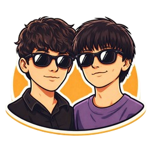

# Usability Report

### Evaluación de usabilidad del proyecto Remake Champions Burger

25/05/2026

[Remake Champions Burger](https://github.com/DIU3-Clenchaos/UX_CaseStudy)

### Realizado por:  

Equipo Solanum. Proyecto "Gravity Brew". Compuesto por:
* Manuel Martínez Cobos
* Ana Cascone Hernández

## 1 RESUMEN EJECUTIVO  (Executive Summary)

- **Objetivo:** Evaluamos el rediseño de la web oficial del evento gastronómico The Champions Burger. El objetivo principal es dar solución a las carencias detectadas en la plataforma actual para implementar mejoras clave, como un mapa interactivo, tiempos restantes de cola e información detallada de las hamburguesas.
 
- **Metodología:** La evaluación se apoya en un enfoque mixto que incluye A/B Testing para comparar el rendimiento y usabilidad del diseño original frente a otra propuesta (Caso A vs Caso B); el cuestionario SUS (System Usability Scale) para cuantificar la satisfacción del usuario; y pruebas de Eye Tracking (mediante GazeRecorder) para analizar el comportamiento visual y los mapas de calor en la interfaz.
  
- **Principales Hallazgos:**
* Existe una gran dificultad por parte de los usuarios para encontrar información relevante de forma rápida.

* Hay una falta evidente de herramientas de filtrado eficientes para el contenido.

* La navegación actual genera una experiencia de usuario (UX) poco fluida y frustrante.
  
- **Resultado Global:** Su diseño es aceptable, aunque poco adaptado a gente no muy inmersa en el mundillo, es una clara mejora respecto al actual e implementa interesantes mejoras que seguro que contentarán a su público de nicho.

## 2. Metodología y Reclutamiento

- **Perfil de los participantes:** Hemos contado con participantes de perfiles muy variados para este experimento, pertenecientes a distintas franjas de edad, adaptación tecnológica y gremios.
  
- **Escenario de la prueba:** Los usuarios llevaron a cabo 3 tareas principales.
  
* En primer lugar, entraron a la página sin saber su temática y trataron de acertarla con la información de la página principal; tuvieron éxito en la tarea.
* Luego, trataron de realizar una reserva de una mesa. El usuario menos adaptado a la tecnología fue incapaz, ya quie la navegación perdía el header en algunas páginas y resultaba confusa.
* Por último trataron de encontrar una opción en el menú apta para consumir teniendo en cuenta su condición alérgena. Todos la encontraron de manera manual, pero coincidieron en que un filtro habría facilitado el proceso.
  
- **Herramientas:** Se usó (como ya se ha mencionado con anterioridad) GazeMapping para crear los Heat Maps correspondientes, así como navegador web y teléfono móvil para realizar las pruebas de los usuarios

## 3. Resultados del Cuestionario SUS (Datos Cuantitativos)

- **Comparativa A vs. B:**
  
  
  
> [!NOTE]
> Es importante mencionar que se evaluan los 10 puntos del Cuestionario SUS hechos por dos personas:
>
> Persona 1 -> [1-10]. Persona 2-> [11-20]
>
> Mencionar que en los apartados 2, 4, 6, 8 y 10 (Y por tanto en el 12, 14, 16, 18 y 20) se busca obtener un resultado cuanto más bajo mejor

- **Desglose por ítems:** El Caso B, que es el objetivo de análisis de este documento, recibe una puntuación especialmente mala de la Persona 2, que es la más mayor y menos adaptada a la tecnología de toda nuestra muestra, y que se ve superada por su interfaz poco accesible. Recibe puntuaciones malas por inconsistencia y complejidad en las rutas de información.

## 4. Análisis de Eye Tracking (Datos Biométricos)

[Presenta la evidencia visual del comportamiento del usuario]

- **Heatmaps (Mapas de calor):** Incluye las capturas de GazeMapping. Comenta si los usuarios miraron los **POI** (Puntos de Interés) definidos.
- **Zonas de Silencio:** Identifica elementos importantes que fueron totalmente ignorados.
- **Hallazgo clave:** Ejemplo: "El 80% de los usuarios ignoró el botón de CTA debido a su ubicación en el margen inferior".

## 5. Auditoría de Accesibilidad

Al estar únicamente en formato foto ha sido imposible realizar este apartado mediante herramientas técnicas.

Es posible que resulte problemático por los tamaños de letra pequeños del header, las imágenes con texto incrustado (intraducibles) y la complejidad de las rutas y la información. Pero no se puede evaluar con herramientas hasta el paso a Figma/Web.

## 6. Conclusiones y Recomendaciones (Actionable Insights)

| **Prioridad**      | **Hallazgo**                                                 | **Recomendación de Mejora**                                   |
| ------------------ | ------------------------------------------------------------ | ------------------------------------------------------------- |
| **Alta (Crítica)** | El header desaparece                                         | Revisar y corregir a la hora de pasar a código en producción  |
| **Media**          | Alta complejidad de las rutas                                | Facilitar más accesos en el header                            |
| **Baja**           | Tamaño de letra muy pequeño                                  | Aumentar el tamaño de la letra a ña hora de pasar a producción|

