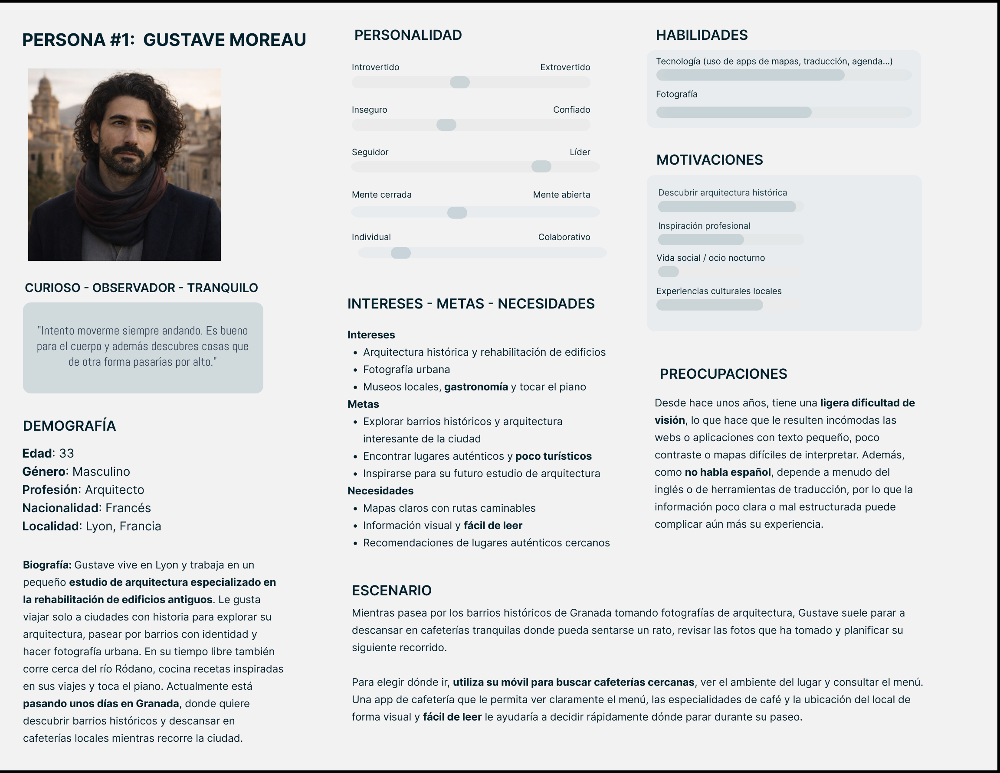
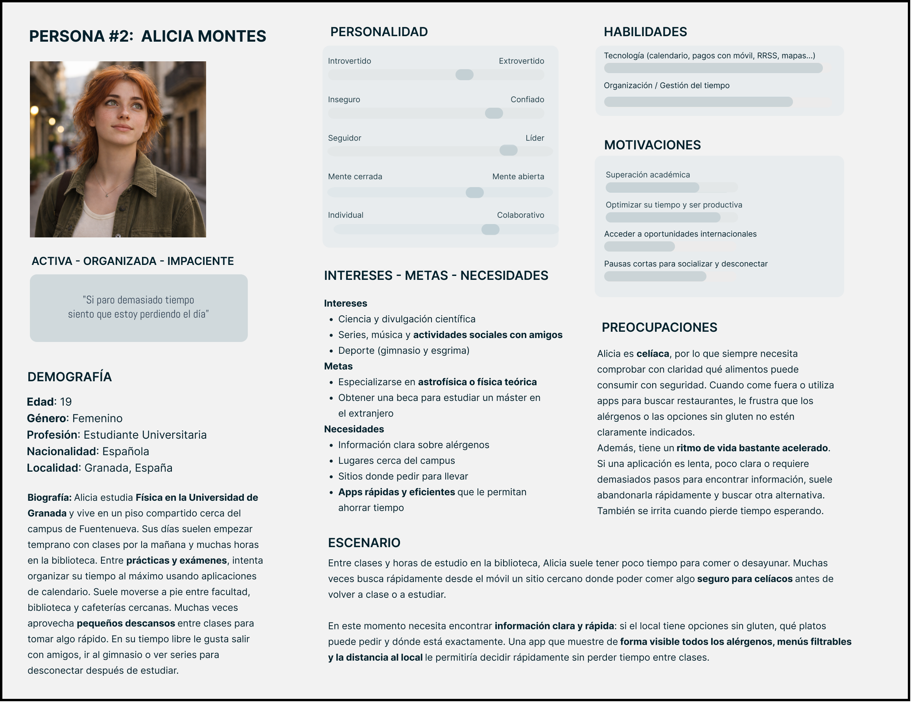
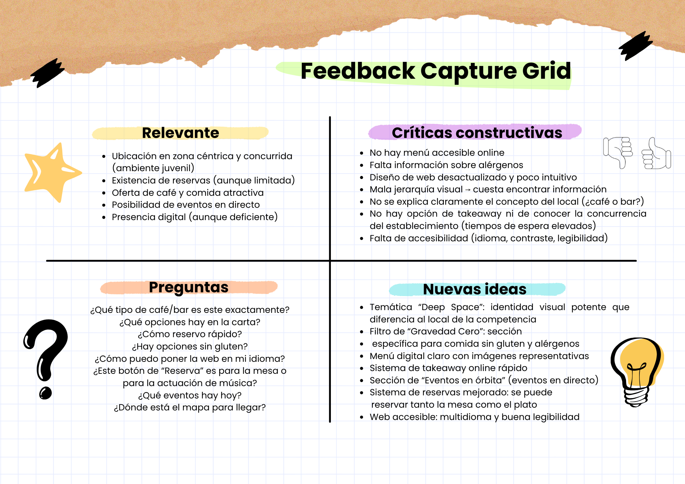
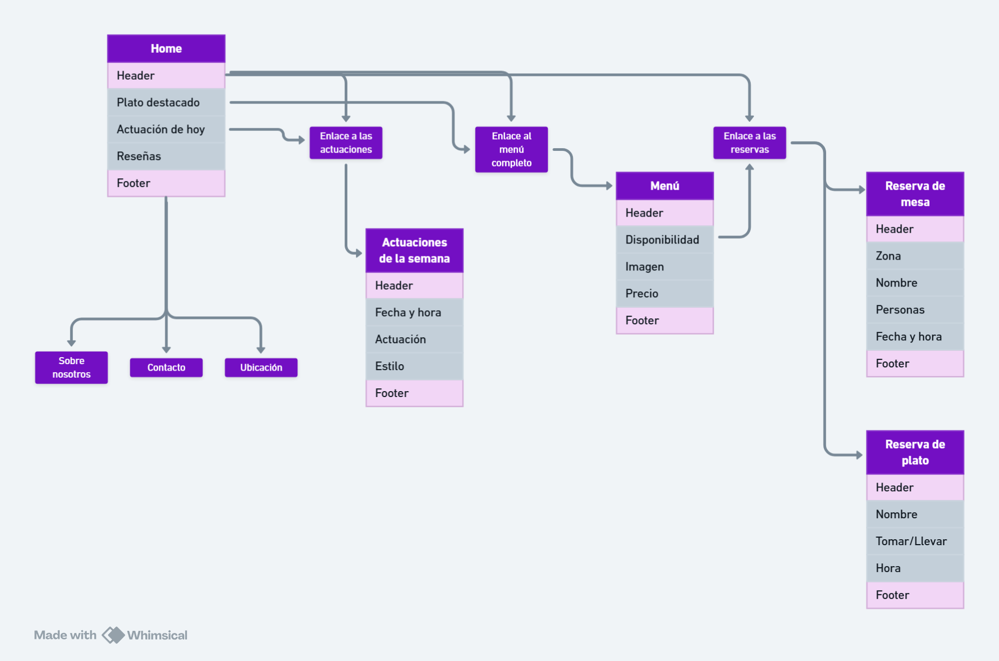

# DIU26
Prácticas Diseño Interfaces de Usuario (Tema: Cafetería y experiencia Barista) 

## Paso 0 My UX-Case Study
 
-----

Grupo: DIU2_Solanum.  Curso: 2025/26 

Nombre del Proyecto: 

>>> Decida el nombre corto de su propuesta en la práctica 2 

Descripción: 

>>> Describa la idea de su producto en la práctica 2 

Logotipo: 

>>> Si diseña un logotipo para su producto en la práctica 3 pongalo aqui, a un tamaño adecuado. Si diseña un slogan añadalo aquí

Miembros y nombre del equipo:
 * :bust_in_silhouette:  Manuel Martínez Cobos     :octocat:     
 * :bust_in_silhouette:  Ana Cascone Hernández     :octocat:

----- 

 

# Proceso de Diseño 

 

## Paso 1. UX User & Desk Research & Analisis 

 1.a User Reseach Plan
-----

&nbsp;&nbsp;&nbsp;&nbsp;&nbsp;&nbsp;&nbsp;&nbsp;El proyecto seleccionado es <strong>Bambi Café and Bar</strong>, ubicado en la calle Gonzalo Gallas de Granada. Se sitúa en una zona muy competitiva y referente del ocio juvenil, por lo que resulta fundamental diferenciarse. El <strong>objetivo del estudio</strong> es analizar cómo los usuarios descubren y eligen este tipo de locales y qué información esperan encontrar en sus páginas web.

&nbsp;&nbsp;&nbsp;&nbsp;&nbsp;&nbsp;&nbsp;&nbsp;La investigación se centrará principalmente en <strong>estudiantes y jóvenes usuarios digitales</strong>, que suelen buscar cafeterías a través de <strong>Google, redes sociales o recomendaciones</strong>. Para comprender sus necesidades realizaremos <strong>desk research, análisis de competidores</strong> y la definición de <strong>personas (perfiles de usuario)</strong>, identificando posibles problemas de <strong>información, navegación y diseño</strong>. Con estos datos podremos evaluar la experiencia de usuario y detectar oportunidades de mejora en la presencia digital del local.

&nbsp;&nbsp;&nbsp;&nbsp;&nbsp;&nbsp;&nbsp;&nbsp;Como equipo, frecuentamos locales orientados a un público joven y, aunque no pertenecemos al mundo barista, valoramos especialmente aquellos que ofrecen una <strong>información, navegación y diseño</strong> y <strong>opciones más allá del café</strong>. Además, contamos con experiencia en <strong>desarrollo web, aplicaciones móviles y diseño</strong>, lo que nos permite proponer soluciones adaptadas a las necesidades digitales de este público.

 1.b Competitive Analysis
-----

&nbsp;&nbsp;&nbsp;&nbsp;&nbsp;&nbsp;&nbsp;&nbsp;Para el análisis competitivo, examinaremos los que son, bajo nuestro criterio, los puntos más importantes de la web de negocios de este tipo. Realizaremos la comparación de nuestro negocio objetivo con otros dos más, <strong>Mundy`s</strong> y <strong>Coffe Brunch Lina</strong>; negocios de mucho éxito que comparten ubicación con nuestra elección.

 1.c Personas
-----

&nbsp;&nbsp;&nbsp;&nbsp;&nbsp;&nbsp;&nbsp;&nbsp;Gustave tiene 33 años, es arquitecto y vive en Lyon, donde trabaja en la rehabilitación de edificios antiguos. Es tranquilo, curioso y observador, con un gran interés por la arquitectura, la fotografía urbana y los barrios con identidad propia. Le gusta viajar solo, recorrer ciudades históricas a pie, visitar pequeños museos y descubrir rincones poco turísticos. Actualmente está pasando unos días de vacaciones en Granada y utiliza el móvil para orientarse, buscar cafeterías y encontrar lugares interesantes durante sus paseos. Además, desde hace unos años tiene una ligera dificultad visual, por lo que le resultan incómodas las webs o aplicaciones con texto pequeño, poco contraste o mapas difíciles de leer; por eso valora especialmente las interfaces claras, visuales y fáciles de interpretar.

 

&nbsp;&nbsp;&nbsp;&nbsp;&nbsp;&nbsp;&nbsp;&nbsp;Alicia tiene 20 años y estudia Física en la Universidad de Granada. Es una persona activa, organizada y resolutiva, acostumbrada a gestionar un ritmo de vida intenso entre clases, estudio y trabajos en grupo. Utiliza mucho el móvil para planificar su día y resolver tareas rápidamente. En su tiempo libre le gusta salir con amigos, escuchar música, ver series y hacer algo de deporte. Como es celíaca, necesita encontrar fácilmente opciones de comida sin gluten cuando come fuera, por lo que valora especialmente la información clara y rápida en apps o menús.

 1.d User Journey Map
----

Experiencia de Gustave:
.png)

Experiencia de Alicia:
.png)

&nbsp;&nbsp;&nbsp;&nbsp;&nbsp;&nbsp;&nbsp;&nbsp;Las dos experiencias ocurren principalmente por la <strong>falta de información clara</strong> y <strong>la mala adaptación del servicio a las necesidades de cada usuario</strong>.
En el caso de Gustave, el problema se encuentra sobre todo en la <strong>información previa</strong>: la web no está en un idioma que entienda, no muestra el menú y no explica correctamente qué tipo de lugar es. Esto hace que llegue con <strong>expectativas equivocadas</strong>. Aunque la comida y el café están bien, la experiencia no encaja con lo que necesitaba.
En el caso de Alicia, la experiencia se ve afectada por la <strong>falta de rápidez</strong> y de <strong>información sobre alérgenos</strong>. Como celíaca y como estudiante con poco tiempo entre clases, necesita saber rápidamente lo que puede o no comer. Al no encontrar el menú ni información sobre gluten, se frustra y pierde tiempo. Cuando llega al local tampoco recibe suficiente confianza para pedir comida. 
 
&nbsp;&nbsp;&nbsp;&nbsp;&nbsp;&nbsp;&nbsp;&nbsp;Este tipo de situaciones son habituales, sobre todo en locales pequeños donde <strong>la información online no está bien pensada para los usuarios</strong>. Muchas veces el <strong>producto es bueno</strong>, pero la experiencia falla porque la web, la información o el servicio no responden bien a lo que las personas necesitan.

 1.e Usability Review
----

&nbsp;&nbsp;&nbsp;&nbsp;&nbsp;&nbsp;&nbsp;&nbsp;Bambi Café & Bar obtiene <strong>202 puntos de 450 posibles</strong>, dejando claro que su página web <strong>no cumple los requisitos mínimos exigibles</strong> para ser agradable al usuario. Pese a estar claro el funcionamiento de los formularios de reserva y feedback, estos están desordenados y antiguos, falta información importante, las imágenes están mal formateadas y no aportan información y lo que la página aporta al usuario hace replantearse hasta qué punto es rentable mantener el dominio si no hay intención de cambiar el diseño.
 

[Ver Usability Review](P1/Usability-review-puntuado.pdf)

 1.f Briefing
----

&nbsp;&nbsp;&nbsp;&nbsp;&nbsp;&nbsp;&nbsp;&nbsp;El análisis de la experiencia de usuario en la web de <strong>Bambie Café &amp; Bar</strong> nos ha demostrado que su <strong>presencia digital no responde adecuadamente a las necesidades de su público objetivo</strong>, compuesto principalmente por estudiantes, jóvenes usuarios móviles y visitantes ocasionales. Aunque el local se encuentra en una zona muy competitiva de Granada, su web <strong>no aprovecha el potencial de diferenciación</strong> que debería ofrecer una experiencia digital clara, accesible y orientada a la decisión rápida.
 
 
A partir del análisis de usuarios, la comparación con competidores y la evaluación de usabilidad, se identifican varios <strong>problemas relevantes</strong>:
<ul>
 <li><strong>Ausencia de información esencial</strong> como el menú o los alérgenos</li>
 <li><strong>Dificultades de comprensión</strong> sobre el tipo de local</li>
 <li><strong>Diseño visual desactualizado</strong></li>
 <li><strong>Imágenes poco funcionales</strong> y una <strong>estructura confusa</strong> en formularios y contenidos</li>
</ul>
Estas carencias afectan directamente a la experiencia del usuario, especialmente en perfiles que necesitan rapidez, accesibilidad o información concreta antes de visitar el establecimiento.
 
 
&nbsp;&nbsp;&nbsp;&nbsp;&nbsp;&nbsp;&nbsp;&nbsp;En conjunto, el sitio transmite una <strong>imagen poco cuidada</strong> y genera insatisfacción en momentos clave del recorrido del usuario. Podemos confirmar un <strong>nivel de usabilidad bajo</strong>, lo que sugiere la necesidad de un <strong>rediseño centrado en la claridad informativa y la accesibilidad</strong> para mejorar tanto la percepción del negocio como su capacidad de atraer clientes.

## Paso 2. UX Design  

>>> Cualquier título puede ser adaptado. Recuerda borrar estos comentarios del template en tu documento

### 2.a Reframing / IDEACION: Feedback Capture Grid / EMpathy map 
 
----

!!!!!!!!!!!!!!!!!!!!!!!!!!!!!!!!!!!! RECUERDA CAMBIAR EL NOMBRE DEL CAFÉ

&nbsp;&nbsp;&nbsp;&nbsp;&nbsp;&nbsp;&nbsp;&nbsp;Hemos realizado un Feedback Capture Grid sobre la página web de Bambi Café & Bar, en el que hemos sintetizado los aspectos más relevantes identificados durante el análisis del paso 1. Este ejercicio nos permite organizar los principales puntos fuertes, debilidades, dudas de los usuarios y oportunidades de mejora, sirviendo como base para replantear el diseño de la plataforma desde un enfoque centrado en el usuario.
  
&nbsp;&nbsp;&nbsp;&nbsp;&nbsp;&nbsp;&nbsp;&nbsp;“Bambi Café & Bar” cuenta con una ubicación privilegiada, pero presenta una identidad digital débil y poco funcional.
Nuestra propuesta, “[Insertar nombre del café]”, plantea un rebranding temático espacial (“Deep Space”) junto a una nueva estructura web centrada en la accesibilidad, la toma de decisiones rápida y la diferenciación frente a la competencia. Se prioriza la reserva de platos (para optimizar el tiempo de usuarios como Alicia), la accesibilidad visual (para usuarios como Gustave) y la integración de eventos en directo para fomentar el ocio nocturno. 

Interesante / relevante
- Ubicación en zona céntrica y concurrida (ambiente juvenil)
- Existencia de reservas (aunque limitada)
- Oferta de café y comida atractiva
- Posibilidad de eventos en directo
- Presencia digital (aunque muy deficiente)

Críticas constructivas
- No hay menú accesible online
- Falta información sobre alérgenos (especialmente gluten)
- Diseño web desactualizado y poco intuitivo
- Mala jerarquía visual → cuesta encontrar información
- No se explica claramente el concepto del local (¿Café o Bar?)
- No hay opción de Take-away ni de conocer la concurrencia del establecimiento (tiempos de espera elevados)
- Falta de accesibilidad (idioma, contraste, legibilidad)

Preguntas / Dudas
- ¿Qué tipo de café/bar es este exactamente?
- ¿Qué opciones hay en la carta?
- ¿Cómo reservo rápido?
- ¿Hay opciones sin gluten?
- ¿Cómo puedo poner la web en mi idioma?
- ¿Este botón de “Reserva” es para la mesa o para la actuación de música?
- ¿Hay eventos hoy?
- ¿Dónde está el mapa para llegar?

Nuevas ideas
- Temática “Deep Space”: identidad visual potente que diferencia al local de la competencia. Llama la atención tanto de jóvenes estudiantes como de gente curiosa (turistas).
- Menú digital claro con imágenes útiles
- Sistema de take away online rápido
- Filtro de “Gravedad cero”: sección específica para comida sin gluten y alérgenos
- Sección de eventos en directo
- Sistema de reservas mejorado: se puede reservar tanto la mesa como el plato específico
- Web accesible: multi idioma y con buena legibilidad

&nbsp;&nbsp;&nbsp;&nbsp;&nbsp;&nbsp;&nbsp;&nbsp;La web actual no facilita la toma de decisiones ni proporciona información clave, afectando especialmente a usuarios que requieren rapidez, accesibilidad o información específica.
 
<strong> Propuesta de valor</strong>
 
&nbsp;&nbsp;&nbsp;&nbsp;&nbsp;&nbsp;&nbsp;&nbsp;Diseñar una experiencia web clara, accesible y temática, que incorpore menú digital con filtros, reservas optimizadas y take away, permitiendo a los usuarios tomar decisiones rápidas y satisfactorias, mejorando la percepción del local y su capacidad de atracción. 

### 2.b ScopeCanvas

----

>>> Propuesta de valor, pero ahora en vez de un texto es un ScopeCanvas que has subido a P2/ y enlazado desde aqui. Tambien vale una imagen miniatura del recurso.
>>> No olvides que tu propuesta ya tiene un nombre corto y puedes actualizar la cabecera de este archivo

### 2.c User Flow (task) analysis 
 
-----

>>> Definir "User Map" y "Task Flow" ... enlazar desde P2/ y describir brevemente

### 2.d IA: Sitemap + Labelling 
 
----

Término | Significado     
| ------------- | -------
  Home  | Página principal o inicio. Punto de partida.
  Menú  | Acceso al listado completo de platos y bebidas.
  Actuaciones de la semana  | Sección de actuaciones en vivo y eventos culturales.
  Reservar Mesa  | Proceso para asegurar un lugar en el local.
  Personas  | Número de comensales para la reserva.
  Ubicación  | Cómo llegar y mapa del establecimiento.
  Opiniones  | Carrusel de reseñas volcadas desde Google, TripAdvisor, ...
  Plato destacado  | Plato con más exito en los últimos días.
  Contacto  | Formulario o vías de comunicación directa.
  Tomar/Llevar  | Selector para decidir dónde se consumirá el plato.
  Header  | Cabecera de la página web.
  Footer  | Pie de página.

### 2.e Wireframes
 
-----

>>> Plantear el diseño del layout para Web/movil (organización y simulación). Describa la herramienta usada 

 

## Paso 3. Mi UX-Case Study (diseño)

>>> Cualquier título puede ser adaptado. Recuerda borrar estos comentarios del template en tu documento

### 3.a Moodboard

-----

>>> Diseño visual con una guía de estilos visual (moodboard) 
>>> Incluir Logotipo. Todos los recursos estarán subidos a la carpeta P3/
>>> Explique aqui la/s herramienta/s utilizada/s y el por qué de la resolución empleada. Reflexione ¿Se puede usar esta imagen como cabecera de Instagram, por ejemplo, o se necesitan otras?

### 3.b Landing Page
 
----

>>> Plantear el Landing Page del producto. Aplica estilos definidos en el moodboard

### 3.c Guidelines
 
----

>>> Estudio de Guidelines y explicación de los Patrones IU a usar 
>>> Es decir, tras documentarse, muestre las deciones tomadas sobre Patrones IU a usar para la fase siguiente de prototipado. 

### 3.d Mockup
 
----

>>> Consiste en tener un Layout en acción. Un Mockup es un prototipo HTML que permite simular tareas con estilo de IU seleccionado. Muy útil para compartir con stakeholders

 

## Paso 4. Pruebas de Evaluación 

### 4.a Reclutamiento de usuarios 

-----

>>> Breve descripción del caso asignado (llamado Caso-B) con enlace al repositorio Github
>>> Tabla y asignación de personas ficticias (o reales) a las pruebas. Exprese las ideas de posibles situaciones conflictivas de esa persona en las propuestas evaluadas. Mínimo 4 usuarios: asigne 2 al Caso A y 2 al caso B.

| Usuarios | Sexo/Edad     | Ocupación   |  Exp.TIC    | Personalidad | Plataforma | Caso
| ------------- | -------- | ----------- | ----------- | -----------  | ---------- | ----
| User1's name  | H / 18   | Estudiante  | Media       | Introvertido | Web.       | A 
| User2's name  | H / 18   | Estudiante  | Media       | Timido       | Web        | A 
| User3's name  | M / 35   | Abogado     | Baja        | Emocional    | móvil      | B 
| User4's name  | H / 18   | Estudiante  | Media       | Racional     | Web        | B 

### 4.b Diseño de las pruebas 
 
-----

>>> Planifique qué pruebas se van a desarrollar. ¿En qué consisten? ¿Se hará uso del checklist de la P1?

### 4.c Cuestionario SUS
 
----

>>> Como uno de los test para la prueba A/B testing, usaremos el **Cuestionario SUS** que permite valorar la satisfacción de cada usuario con el diseño utilizado (casos A o B). Para calcular la valoración numérica y la etiqueta linguistica resultante usamos la [hoja de cálculo](https://github.com/mgea/DIU19/blob/master/Cuestionario%20SUS%20DIU.xlsx). Previamente conozca en qué consiste la escala SUS y cómo se interpretan sus resultados
http://usabilitygeek.com/how-to-use-the-system-usability-scale-sus-to-evaluate-the-usability-of-your-website/)
Para más información, consultar aquí sobre la [metodología SUS](https://cui.unige.ch/isi/icle-wiki/_media/ipm:test-suschapt.pdf)
>>> Adjuntar en la carpeta P4/ el excel resultante y describa aquí la valoración personal de los resultados 

### 4.d A/B Testing
 
-----

>>> Los resultados de un A/B testing con 3 pruebas y 2 casos o alternativas daría como resultado una tabla de 3 filas y 2 columnas, además de un resultado agregado global. Especifique con claridad el resultado: qué caso es más usable, A o B?

### 4.e Aplicación del método Eye Tracking 

----

>>> Indica cómo se diseña el experimento y se reclutan los usuarios. Explica la herramienta / uso de gazerecorder.com u otra similar. Aplíquese únicamente al caso B.

  
>>> Cambiar esta img por una de vuestro experimento. El recurso deberá estar subido a la carpeta P4/  

>>> gazerecorder en versión de pruebas puede estar limitada a 3 usuarios para generar mapa de calor (crédito > 0 para que funcione) 

### 4.f Usability Report de B
 
-----

>>> Añadir report de usabilidad para práctica B (la de los compañeros) aportando resultados y valoración de cada debilidad de usabilidad. 
>>> Enlazar aqui con el archivo subido a P4/ que indica qué equipo evalua a qué otro equipo.

>>> Complementad el Case Study en su Paso 4 con una Valoración personal del equipo sobre esta tarea

 

## Paso 5. Exportación y Documentación 

### 5.a Exportación a HTML/React
 
----

>>> Breve descripción de esta tarea. Las evidencias de este paso quedan subidas a P5/

### 5.b Documentación con Storybook

----

>>> Breve descripción de esta tarea. Las evidencias de este paso quedan subidas a P5/

 

## Conclusiones finales & Valoración de las prácticas

>>> Opinión FINAL del proceso de desarrollo de diseño siguiendo metodología UX y valoración (positiva /negativa) de los resultados obtenidos. ¿Qué se puede mejorar? Recuerda que este tipo de texto se debe eliminar del template que se os proporciona 

