# DIU26
Prácticas Diseño Interfaces de Usuario (Tema: Cafetería y experiencia Barista) 

## Paso 0 My UX-Case Study
 
-----

Grupo: DIU2_Solanum.  Curso: 2025/26 

Nombre del Proyecto: Gravity Brew

Descripción: 

>>> Describa la idea de su producto en la práctica 2 

Logotipo: 

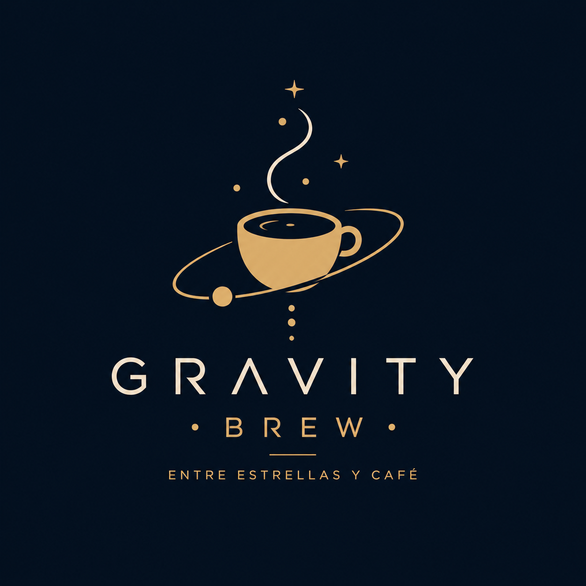

Miembros y nombre del equipo:
 * :bust_in_silhouette:  Manuel Martínez Cobos     :octocat:     
 * :bust_in_silhouette:  Ana Cascone Hernández     :octocat:

----- 

 

# Proceso de Diseño 

 

## Paso 1. UX User & Desk Research & Analisis 

 1.a User Reseach Plan
-----

&nbsp;&nbsp;&nbsp;&nbsp;&nbsp;&nbsp;&nbsp;&nbsp;El proyecto seleccionado es <strong>Bambi Café and Bar</strong>, ubicado en la calle Gonzalo Gallas de Granada. Se sitúa en una zona muy competitiva y referente del ocio juvenil, por lo que resulta fundamental diferenciarse. El <strong>objetivo del estudio</strong> es analizar cómo los usuarios descubren y eligen este tipo de locales y qué información esperan encontrar en sus páginas web.

&nbsp;&nbsp;&nbsp;&nbsp;&nbsp;&nbsp;&nbsp;&nbsp;La investigación se centrará principalmente en <strong>estudiantes y jóvenes usuarios digitales</strong>, que suelen buscar cafeterías a través de <strong>Google, redes sociales o recomendaciones</strong>. Para comprender sus necesidades realizaremos <strong>desk research, análisis de competidores</strong> y la definición de <strong>personas (perfiles de usuario)</strong>, identificando posibles problemas de <strong>información, navegación y diseño</strong>. Con estos datos podremos evaluar la experiencia de usuario y detectar oportunidades de mejora en la presencia digital del local.

&nbsp;&nbsp;&nbsp;&nbsp;&nbsp;&nbsp;&nbsp;&nbsp;Como equipo, frecuentamos locales orientados a un público joven y, aunque no pertenecemos al mundo barista, valoramos especialmente aquellos que ofrecen una <strong>información, navegación y diseño</strong> y <strong>opciones más allá del café</strong>. Además, contamos con experiencia en <strong>desarrollo web, aplicaciones móviles y diseño</strong>, lo que nos permite proponer soluciones adaptadas a las necesidades digitales de este público.

 1.b Competitive Analysis
-----

&nbsp;&nbsp;&nbsp;&nbsp;&nbsp;&nbsp;&nbsp;&nbsp;Para el análisis competitivo, examinaremos los que son, bajo nuestro criterio, los puntos más importantes de la web de negocios de este tipo. Realizaremos la comparación de nuestro negocio objetivo con otros dos más, <strong>Mundy`s</strong> y <strong>Coffe Brunch Lina</strong>; negocios de mucho éxito que comparten ubicación con nuestra elección.

 1.c Personas
-----

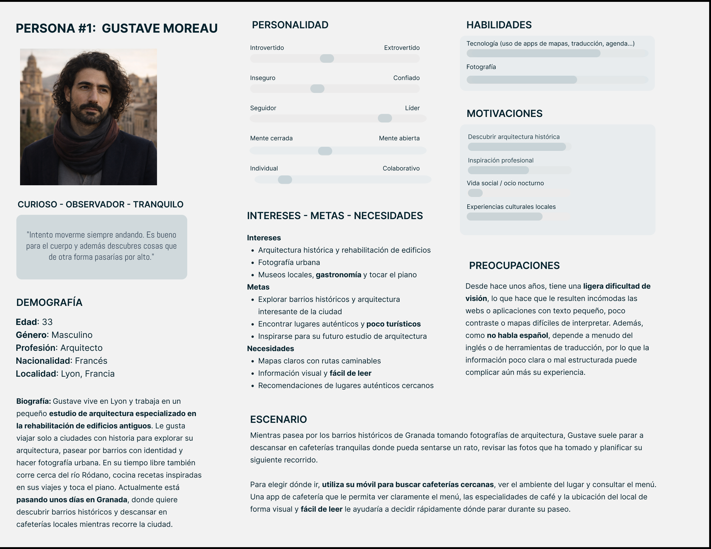

&nbsp;&nbsp;&nbsp;&nbsp;&nbsp;&nbsp;&nbsp;&nbsp;Gustave tiene 33 años, es arquitecto y vive en Lyon, donde trabaja en la rehabilitación de edificios antiguos. Es tranquilo, curioso y observador, con un gran interés por la arquitectura, la fotografía urbana y los barrios con identidad propia. Le gusta viajar solo, recorrer ciudades históricas a pie, visitar pequeños museos y descubrir rincones poco turísticos. Actualmente está pasando unos días de vacaciones en Granada y utiliza el móvil para orientarse, buscar cafeterías y encontrar lugares interesantes durante sus paseos. Además, desde hace unos años tiene una ligera dificultad visual, por lo que le resultan incómodas las webs o aplicaciones con texto pequeño, poco contraste o mapas difíciles de leer; por eso valora especialmente las interfaces claras, visuales y fáciles de interpretar.

 

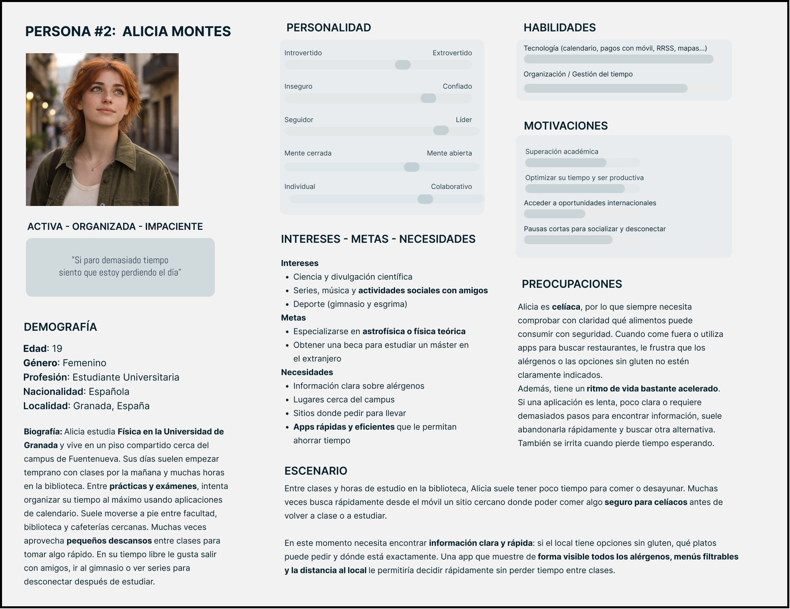

&nbsp;&nbsp;&nbsp;&nbsp;&nbsp;&nbsp;&nbsp;&nbsp;Alicia tiene 20 años y estudia Física en la Universidad de Granada. Es una persona activa, organizada y resolutiva, acostumbrada a gestionar un ritmo de vida intenso entre clases, estudio y trabajos en grupo. Utiliza mucho el móvil para planificar su día y resolver tareas rápidamente. En su tiempo libre le gusta salir con amigos, escuchar música, ver series y hacer algo de deporte. Como es celíaca, necesita encontrar fácilmente opciones de comida sin gluten cuando come fuera, por lo que valora especialmente la información clara y rápida en apps o menús.

 1.d User Journey Map
----

Experiencia de Gustave:
.png)

Experiencia de Alicia:
.png)

&nbsp;&nbsp;&nbsp;&nbsp;&nbsp;&nbsp;&nbsp;&nbsp;Las dos experiencias ocurren principalmente por la <strong>falta de información clara</strong> y <strong>la mala adaptación del servicio a las necesidades de cada usuario</strong>.
En el caso de Gustave, el problema se encuentra sobre todo en la <strong>información previa</strong>: la web no está en un idioma que entienda, no muestra el menú y no explica correctamente qué tipo de lugar es. Esto hace que llegue con <strong>expectativas equivocadas</strong>. Aunque la comida y el café están bien, la experiencia no encaja con lo que necesitaba.
En el caso de Alicia, la experiencia se ve afectada por la <strong>falta de rápidez</strong> y de <strong>información sobre alérgenos</strong>. Como celíaca y como estudiante con poco tiempo entre clases, necesita saber rápidamente lo que puede o no comer. Al no encontrar el menú ni información sobre gluten, se frustra y pierde tiempo. Cuando llega al local tampoco recibe suficiente confianza para pedir comida. 
 
&nbsp;&nbsp;&nbsp;&nbsp;&nbsp;&nbsp;&nbsp;&nbsp;Este tipo de situaciones son habituales, sobre todo en locales pequeños donde <strong>la información online no está bien pensada para los usuarios</strong>. Muchas veces el <strong>producto es bueno</strong>, pero la experiencia falla porque la web, la información o el servicio no responden bien a lo que las personas necesitan.

 1.e Usability Review
----

&nbsp;&nbsp;&nbsp;&nbsp;&nbsp;&nbsp;&nbsp;&nbsp;Bambi Café & Bar obtiene <strong>202 puntos de 450 posibles</strong>, dejando claro que su página web <strong>no cumple los requisitos mínimos exigibles</strong> para ser agradable al usuario. Pese a estar claro el funcionamiento de los formularios de reserva y feedback, estos están desordenados y antiguos, falta información importante, las imágenes están mal formateadas y no aportan información y lo que la página aporta al usuario hace replantearse hasta qué punto es rentable mantener el dominio si no hay intención de cambiar el diseño.
 

[Ver Usability Review](P1/Usability-review-puntuado.pdf)

 1.f Briefing
----

&nbsp;&nbsp;&nbsp;&nbsp;&nbsp;&nbsp;&nbsp;&nbsp;El análisis de la experiencia de usuario en la web de <strong>Bambie Café &amp; Bar</strong> nos ha demostrado que su <strong>presencia digital no responde adecuadamente a las necesidades de su público objetivo</strong>, compuesto principalmente por estudiantes, jóvenes usuarios móviles y visitantes ocasionales. Aunque el local se encuentra en una zona muy competitiva de Granada, su web <strong>no aprovecha el potencial de diferenciación</strong> que debería ofrecer una experiencia digital clara, accesible y orientada a la decisión rápida.
 
 
A partir del análisis de usuarios, la comparación con competidores y la evaluación de usabilidad, se identifican varios <strong>problemas relevantes</strong>:
<ul>
 <li><strong>Ausencia de información esencial</strong> como el menú o los alérgenos</li>
 <li><strong>Dificultades de comprensión</strong> sobre el tipo de local</li>
 <li><strong>Diseño visual desactualizado</strong></li>
 <li><strong>Imágenes poco funcionales</strong> y una <strong>estructura confusa</strong> en formularios y contenidos</li>
</ul>
Estas carencias afectan directamente a la experiencia del usuario, especialmente en perfiles que necesitan rapidez, accesibilidad o información concreta antes de visitar el establecimiento.
 
 
&nbsp;&nbsp;&nbsp;&nbsp;&nbsp;&nbsp;&nbsp;&nbsp;En conjunto, el sitio transmite una <strong>imagen poco cuidada</strong> y genera insatisfacción en momentos clave del recorrido del usuario. Podemos confirmar un <strong>nivel de usabilidad bajo</strong>, lo que sugiere la necesidad de un <strong>rediseño centrado en la claridad informativa y la accesibilidad</strong> para mejorar tanto la percepción del negocio como su capacidad de atraer clientes.

## Paso 2. UX Design  

 2.a Reframing / IDEACION: Feedback Capture Grid / EMpathy map 
----

&nbsp;&nbsp;&nbsp;&nbsp;&nbsp;&nbsp;&nbsp;&nbsp;Hemos realizado un Feedback Capture Grid sobre la página web de Bambi Café & Bar, en el que hemos sintetizado los aspectos más relevantes identificados durante el análisis del paso 1. Este ejercicio nos permite organizar los principales puntos fuertes, debilidades, dudas de los usuarios y oportunidades de mejora, sirviendo como base para replantear el diseño de la plataforma desde un enfoque centrado en el usuario.
  
&nbsp;&nbsp;&nbsp;&nbsp;&nbsp;&nbsp;&nbsp;&nbsp;“Bambi Café & Bar” cuenta con una ubicación privilegiada, pero presenta una identidad digital débil y poco funcional.
Nuestra propuesta, “Gravity Brew”, plantea un rebranding temático espacial (“Deep Space”) junto a una nueva estructura web centrada en la accesibilidad, la toma de decisiones rápida y la diferenciación frente a la competencia. Se prioriza la reserva de platos (para optimizar el tiempo de usuarios como Alicia), la accesibilidad visual (para usuarios como Gustave) y la integración de eventos en directo para fomentar el ocio nocturno. 

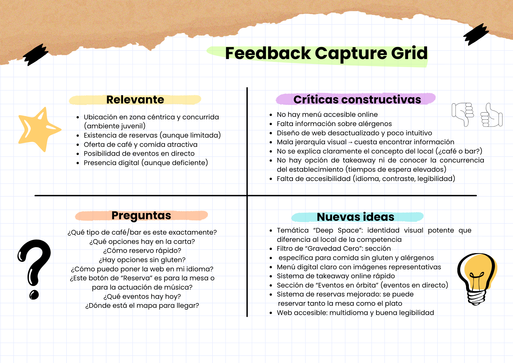

&nbsp;&nbsp;&nbsp;&nbsp;&nbsp;&nbsp;&nbsp;&nbsp;La web actual no facilita la toma de decisiones ni proporciona información clave, afectando especialmente a usuarios que requieren rapidez, accesibilidad o información específica.
 
<strong> Propuesta de valor</strong>
 
&nbsp;&nbsp;&nbsp;&nbsp;&nbsp;&nbsp;&nbsp;&nbsp;Diseñar una experiencia web clara, accesible y temática, que incorpore menú digital con filtros, reservas optimizadas y take away, permitiendo a los usuarios tomar decisiones rápidas y satisfactorias, mejorando la percepción del local y su capacidad de atracción. 

 2.b ScopeCanvas
----

&nbsp;&nbsp;&nbsp;&nbsp;&nbsp;&nbsp;&nbsp;&nbsp;A partir de los insights obtenidos en la fase de ideación, se ha desarrollado un Scope Canvas que permite alinear las necesidades de los usuarios con los objetivos del negocio, definiendo así la propuesta de valor del proyecto.

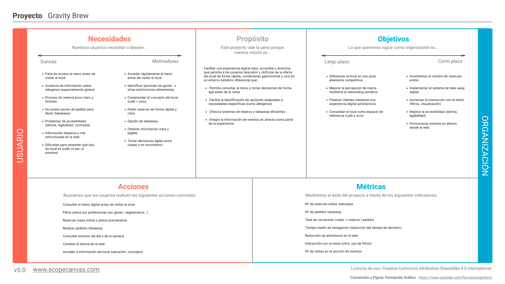

&nbsp;&nbsp;&nbsp;&nbsp;&nbsp;&nbsp;&nbsp;&nbsp;El Scope Canvas nos ha permitido organizar de forma clara las necesidades de los usuarios y los objetivos del negocio, sirviendo como guía para el diseño de la propuesta.
Gracias a esto, la solución planteada responde mejor a los problemas detectados, ofreciendo una experiencia más clara, accesible y útil.

  2.c User Flow (task) analysis 
-----

El **User Map (mapa de usuario)** es una representación estructurada del recorrido completo que realiza un usuario al interactuar con un producto o servicio.

### Características:
- Describe fases o etapas de la experiencia.
- Incluye objetivos, acciones y percepciones del usuario.
- Permite identificar puntos de fricción y oportunidades de mejora.

### Propósito:
Analizar la experiencia global del usuario desde una perspectiva estratégica.

### Caso 1: Cliente nuevo
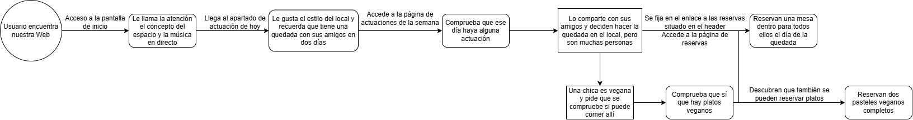

### Caso 2: Cliente habitual
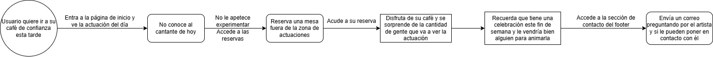

### Caso 3: Estudiante con poco tiempo
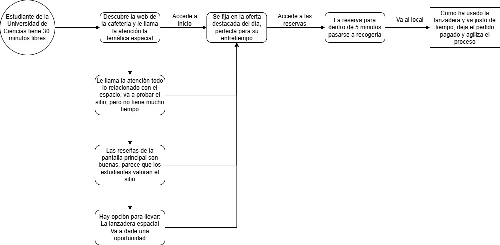

  2.d IA: Sitemap + Labelling 
----

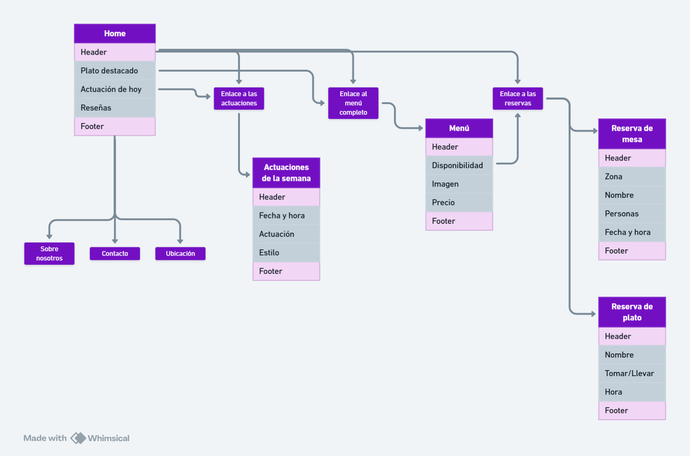

Término | Significado     
| ------------- | -------
  Home  | Página principal o inicio. Punto de partida.
  Menú  | Acceso al listado completo de platos y bebidas.
  Actuaciones de la semana  | Sección de actuaciones en vivo y eventos culturales.
  Reservar Mesa  | Proceso para asegurar un lugar en el local.
  Personas  | Número de comensales para la reserva.
  Ubicación  | Cómo llegar y mapa del establecimiento.
  Opiniones  | Carrusel de reseñas volcadas desde Google, TripAdvisor, ...
  Plato destacado  | Plato con más exito en los últimos días.
  Contacto  | Formulario o vías de comunicación directa.
  Tomar/Llevar  | Selector para decidir dónde se consumirá el plato.
  Header  | Cabecera de la página web.
  Footer  | Pie de página.

  2.e Wireframes
-----

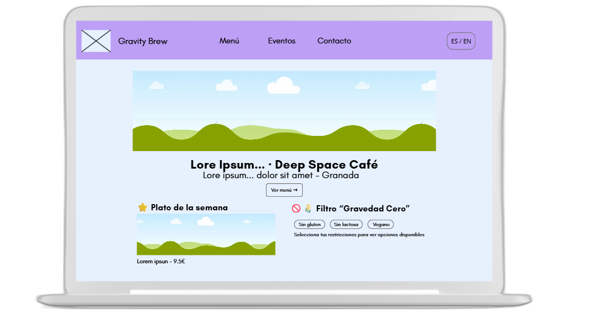

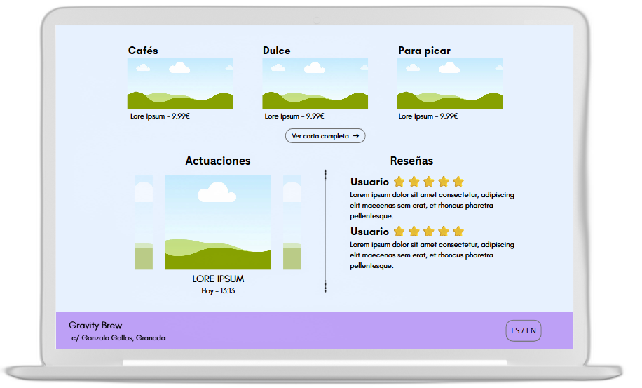

 2.f Conclusiones
---

 &nbsp;&nbsp;&nbsp;&nbsp;&nbsp;&nbsp;&nbsp;&nbsp;El proceso de UX Design ha permitido identificar las principales carencias de la web actual y transformarlas en una propuesta centrada en el usuario. A partir del análisis realizado, se detecta la necesidad de mejorar la accesibilidad, la claridad de la información y la rapidez en la toma de decisiones.   &nbsp;&nbsp;&nbsp;&nbsp;&nbsp;&nbsp;&nbsp;&nbsp;La propuesta “Gravity Brew” responde a estos puntos mediante un rediseño funcional y una identidad temática diferencial (“Deep Space”), que combina experiencia visual y usabilidad. Gracias a la definición del sitemap, los user flows y los wireframes, se plantea una navegación más clara, accesible y eficiente.   &nbsp;&nbsp;&nbsp;&nbsp;&nbsp;&nbsp;&nbsp;&nbsp;En conjunto, la solución mejora la experiencia del usuario y refuerza el posicionamiento del negocio, ofreciendo una propuesta coherente, atractiva y fácil de utilizar. 

 

## Paso 3. Mi UX-Case Study (diseño)

 3.a Moodboard
-----

<strong>Moodboard:</strong>

<strong>Logo:</strong>

 3.b Landing Page
----

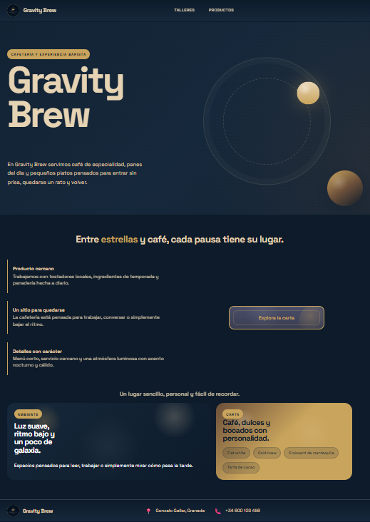

  3.c Guidelines
----

### Sistema visual y patrones de interfaz

&nbsp;&nbsp;&nbsp;&nbsp;&nbsp;&nbsp;&nbsp;&nbsp;El diseño de *Gravity Brew* se basa en un sistema visual ligero inspirado en los principios de *Atomic Design*, priorizando consistencia, reutilización de componentes y claridad visual. La propuesta busca transmitir una experiencia inmersiva y acogedora mediante una estética *Deep Space*, combinando tonos oscuros, acentos dorados y fotografía atmosférica.

#### Sistema de color

La paleta cromática se construye sobre colores oscuros y contrastes cálidos para reforzar la identidad espacial de la marca.

- **Primary:** Azul espacial profundo (#0D1B2A)
- **Secondary:** Dorado cálido (#D4AF69)
- **Neutral:** Gris humo y beige suave para fondos secundarios y textos
- **Feedback:** Tonos claros para estados activos y confirmaciones

Los contrastes fueron revisados para garantizar legibilidad sobre fondos oscuros, especialmente en botones CTA y navegación inferior.

#### Tipografía

La identidad visual de *Gravity Brew* utiliza la tipografía *Space Grotesk* como fuente principal en toda la interfaz. Se seleccionó por su estilo geométrico y contemporáneo, alineado con la estética espacial y tecnológica de la marca.

El uso de una única familia tipográfica permite:

- Mantener coherencia visual entre pantallas
- Simplificar la jerarquía visual
- Mejorar la legibilidad en dispositivos móviles
- Crear una interfaz limpia y moderna

La jerarquía tipográfica se construye mediante variaciones de:

- Tamaño
- Peso tipográfico
- Espaciado
- Contraste cromático

#### Grid y espaciado

El sistema de espaciado utiliza una retícula basada en múltiplos de 8 px, permitiendo mantener alineación visual y escalabilidad responsive mediante *Auto Layout* en Figma.

### Patrones IU utilizados

#### Navegación principal

La aplicación utiliza una *Bottom Navigation Bar* persistente con acceso rápido a:

- Home
- Menú
- Reservas
- Eventos
- Perfil

Este patrón favorece la navegación móvil rápida y reduce la carga cognitiva.

#### Hero Section

La pantalla principal incorpora una *Hero Section* con:

- Imagen atmosférica de fondo
- Headline emocional
- CTA principal (“Reservar mesa”)
- CTA secundario (“Ver menú”)

Este patrón busca captar atención inmediata y reforzar la identidad de marca.

#### Cards reutilizables

Se diseñaron componentes reutilizables tipo *Card* para:

- Productos destacados
- Eventos
- Reservas
- Perfil de usuario

Las cards mantienen consistencia visual mediante bordes redondeados, sombras suaves y jerarquía tipográfica uniforme.

#### Formularios y reservas

La pantalla de reservas utiliza componentes de selección compactos:

- Fecha
- Hora
- Número de personas

Se prioriza minimizar pasos y facilitar la toma rápida de decisiones.

#### Scroll y contenido dinámico

Las pantallas de:

- Menú
- Eventos

implementan *scroll vertical* para permitir explorar contenido extenso sin saturar la interfaz. Este comportamiento mejora la escalabilidad del diseño y la experiencia móvil.

#### Estados e interacción

Se utilizaron variantes de componentes en Figma para representar:

- Botones primarios y secundarios
- Estados activos de navegación
- Confirmaciones de reserva
- Hover y transiciones simuladas mediante herramientas de prototipado de Figma.

Además, se aplicaron principios de diseño responsive utilizando *Auto Layout*, permitiendo adaptar la distribución de componentes y mantener coherencia visual entre pantallas.

 

 3.d Mockup
----

&nbsp;&nbsp;&nbsp;&nbsp;&nbsp;&nbsp;&nbsp;&nbsp;El mockup de <i>Gravity Brew</i> consiste en un prototipo interactivo desarrollado en Figma para dispositivos móviles (iPhone 14 y 15 Pro: 393×852 px). La propuesta simula la experiencia real de navegación de una aplicación de cafetería moderna, integrando interacción, jerarquía visual e identidad temática inspirada en el concepto <i>Deep Space</i>.
El diseño utiliza una estética cinematográfica basada en tonos oscuros, acentos dorados y fotografía atmosférica para reforzar la personalidad de la marca. Además, se implementaron componentes reutilizables, Auto Layout y herramientas de prototipado de Figma para simular comportamientos reales de interfaz y navegación.
Las pantallas de <i>Menú</i> y <i>Eventos</i> incorporan scroll vertical para facilitar la exploración de contenido dinámico sin comprometer la claridad visual ni la experiencia de usuario.
El sistema de navegación se apoya en una barra inferior persistente que permite acceder rápidamente a las principales secciones de la aplicación, reforzando la usabilidad y la accesibilidad en dispositivos móviles.

Las pantallas desarrolladas incluyen:

- Splash screen animada
- Home
- Menú interactivo
- Reservas
- Confirmación de reserva
- Eventos
- Perfil de usuario

El prototipo prioriza:

- Accesibilidad visual
- Navegación intuitiva
- Consistencia visual
- Toma rápida de decisiones
- Experiencia inmersiva y coherente

#### Prototipo interactivo

[Ver prototipo](https://www.figma.com/proto/0quuJyWr4WBHMKHotg97Ty/Gravity-Brew---UX-Case-Study?node-id=1-2&t=kOHKnaPQl31zPoHv-1)

 

 3.e Conclusiones
----

&nbsp;&nbsp;&nbsp;&nbsp;&nbsp;&nbsp;&nbsp;&nbsp;El proyecto *Gravity Brew* surge como una propuesta de diseño UX/UI para una cafetería moderna orientada a jóvenes adultos, estudiantes y profesionales creativos que buscan una experiencia acogedora y diferencial alrededor del café de especialidad.
La identidad visual se inspira en el concepto *Deep Space*, combinando referencias astronómicas, iluminación cálida y una estética cinematográfica para transmitir sensación de calma, desconexión y exploración. El objetivo principal fue diseñar una experiencia digital inmersiva que reforzara tanto la personalidad de marca como la facilidad de uso de la aplicación.

Durante el proceso se trabajó siguiendo distintas fases de diseño:

- Creación de moodboard e identidad visual
- Definición de paleta cromática y tipografía
- Diseño de componentes reutilizables
- Implementación de patrones de interfaz basados en Atomic Design
- Desarrollo de prototipo interactivo en Figma

Para la elaboración del proyecto se utilizaron herramientas como:

- **Figma** para prototipado y diseño de interfaz
- **Animaciones e interacción:** se utilizaron las herramientas de prototipado de Figma para simular navegación, transiciones entre pantallas e interacciones de usuario.
- **Google Fonts** para selección tipográfica
- **Lucide Icons** para iconografía
- Recursos visuales e inspiración asistidos mediante IA para generación de imágenes conceptuales y exploración estética

&nbsp;&nbsp;&nbsp;&nbsp;&nbsp;&nbsp;&nbsp;&nbsp;Uno de los principales objetivos fue mantener coherencia visual y simplicidad estructural mediante un sistema ligero de componentes reutilizables. Esto permitió agilizar el proceso de diseño y mantener consistencia entre todas las pantallas desarrolladas.
Como conclusiones principales, el proyecto demuestra cómo una identidad visual sólida y un sistema de diseño modular pueden mejorar significativamente la experiencia de usuario. Además, el uso de herramientas apoyadas en IA permitió acelerar fases de inspiración visual y exploración creativa, facilitando iteraciones rápidas durante el proceso de diseño.

## Paso 4. Pruebas de Evaluación 

### 4.a Reclutamiento de usuarios 

-----

>>> Breve descripción del caso asignado (llamado Caso-B) con enlace al repositorio Github
>>> Tabla y asignación de personas ficticias (o reales) a las pruebas. Exprese las ideas de posibles situaciones conflictivas de esa persona en las propuestas evaluadas. Mínimo 4 usuarios: asigne 2 al Caso A y 2 al caso B.

| Usuarios | Sexo/Edad     | Ocupación   |  Exp.TIC    | Personalidad | Plataforma | Caso
| ------------- | -------- | ----------- | ----------- | -----------  | ---------- | ----
| User1's name  | H / 18   | Estudiante  | Media       | Introvertido | Web.       | A 
| User2's name  | H / 18   | Estudiante  | Media       | Timido       | Web        | A 
| User3's name  | M / 35   | Abogado     | Baja        | Emocional    | móvil      | B 
| User4's name  | H / 18   | Estudiante  | Media       | Racional     | Web        | B 

### 4.b Diseño de las pruebas 
 
-----

>>> Planifique qué pruebas se van a desarrollar. ¿En qué consisten? ¿Se hará uso del checklist de la P1?

### 4.c Cuestionario SUS
 
----

>>> Como uno de los test para la prueba A/B testing, usaremos el **Cuestionario SUS** que permite valorar la satisfacción de cada usuario con el diseño utilizado (casos A o B). Para calcular la valoración numérica y la etiqueta linguistica resultante usamos la [hoja de cálculo](https://github.com/mgea/DIU19/blob/master/Cuestionario%20SUS%20DIU.xlsx). Previamente conozca en qué consiste la escala SUS y cómo se interpretan sus resultados
http://usabilitygeek.com/how-to-use-the-system-usability-scale-sus-to-evaluate-the-usability-of-your-website/)
Para más información, consultar aquí sobre la [metodología SUS](https://cui.unige.ch/isi/icle-wiki/_media/ipm:test-suschapt.pdf)
>>> Adjuntar en la carpeta P4/ el excel resultante y describa aquí la valoración personal de los resultados 

### 4.d A/B Testing
 
-----

>>> Los resultados de un A/B testing con 3 pruebas y 2 casos o alternativas daría como resultado una tabla de 3 filas y 2 columnas, además de un resultado agregado global. Especifique con claridad el resultado: qué caso es más usable, A o B?

### 4.e Aplicación del método Eye Tracking 

----

>>> Indica cómo se diseña el experimento y se reclutan los usuarios. Explica la herramienta / uso de gazerecorder.com u otra similar. Aplíquese únicamente al caso B.

  
>>> Cambiar esta img por una de vuestro experimento. El recurso deberá estar subido a la carpeta P4/  

>>> gazerecorder en versión de pruebas puede estar limitada a 3 usuarios para generar mapa de calor (crédito > 0 para que funcione) 

### 4.f Usability Report de B
 
-----

>>> Añadir report de usabilidad para práctica B (la de los compañeros) aportando resultados y valoración de cada debilidad de usabilidad. 
>>> Enlazar aqui con el archivo subido a P4/ que indica qué equipo evalua a qué otro equipo.

>>> Complementad el Case Study en su Paso 4 con una Valoración personal del equipo sobre esta tarea

 

## Paso 5. Exportación y Documentación 

### 5.a Exportación a HTML/React
 
----

>>> Breve descripción de esta tarea. Las evidencias de este paso quedan subidas a P5/

### 5.b Documentación con Storybook

----

>>> Breve descripción de esta tarea. Las evidencias de este paso quedan subidas a P5/

 

## Conclusiones finales & Valoración de las prácticas

>>> Opinión FINAL del proceso de desarrollo de diseño siguiendo metodología UX y valoración (positiva /negativa) de los resultados obtenidos. ¿Qué se puede mejorar? Recuerda que este tipo de texto se debe eliminar del template que se os proporciona 

